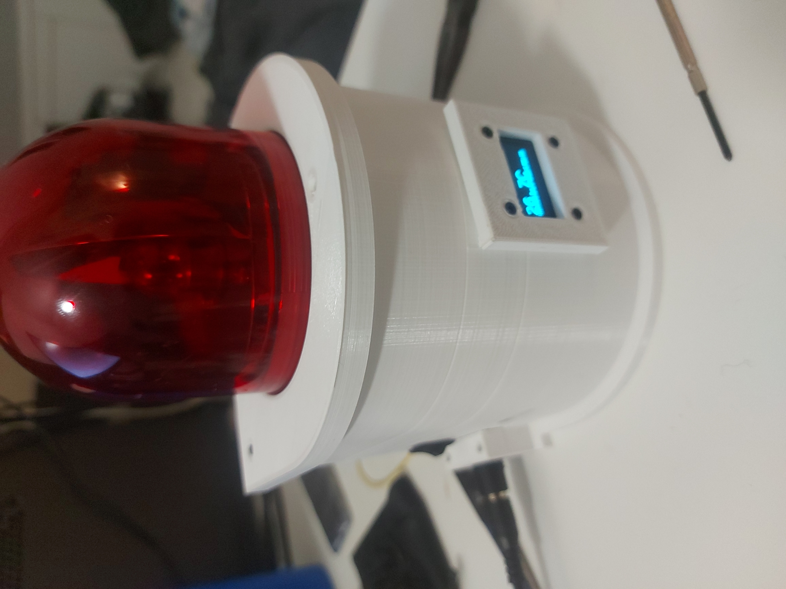
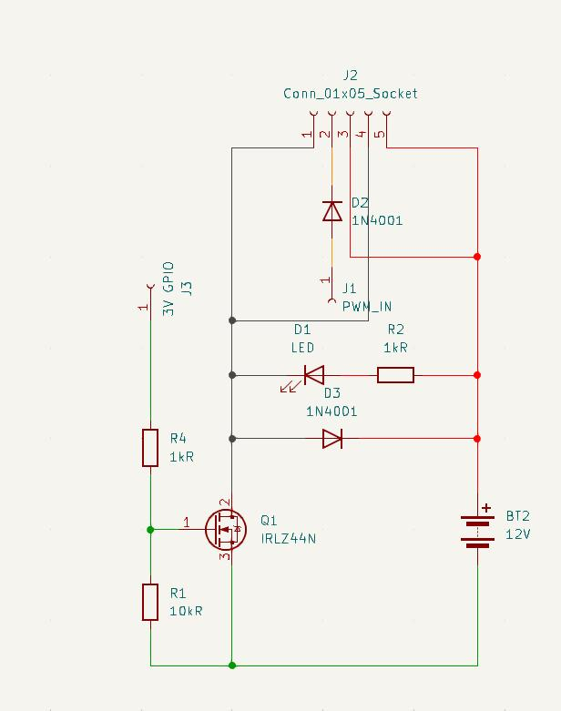

I created an Alarm that listenes to MQTT messages. I picked the alarm up in Japan, it uses pwm and a 12 volt input to work. I wanted to use an esp32 with this project which in hindsight was not the best move per se. To switch the alarm on and off I used a mosfet (IRLZ44N) which worked quite well. The power is supplied by a 2 amp 12 volt powersupply, maybe a usb-C PD board could have been more beautiful to integrate. The esp32 also gets its power from this 12 volt powersupply, only through a 5 volt buck converter. I deemed this to be a bit more safer then just jamming the 12 volt in the esp even though I read this could be possible on some boards. Its got an on off switch on both sides; one for the whole alarm, the other for just the alarm light. The temperature and the message type & alarm message string is displayed on the screen. The case was made in FreeCAD using an parametric design. To reduce wear and tear on the gears of the alarm, it now slowly speeds up and down. 

## future work
I want to use it now in my home, the firmware is a really annoying to get right. After a new linux install i lost i found that some libraries changed a bit. I want to use ESP-HOME for a more smooth experience also with home assistant.


  
  
  
  
